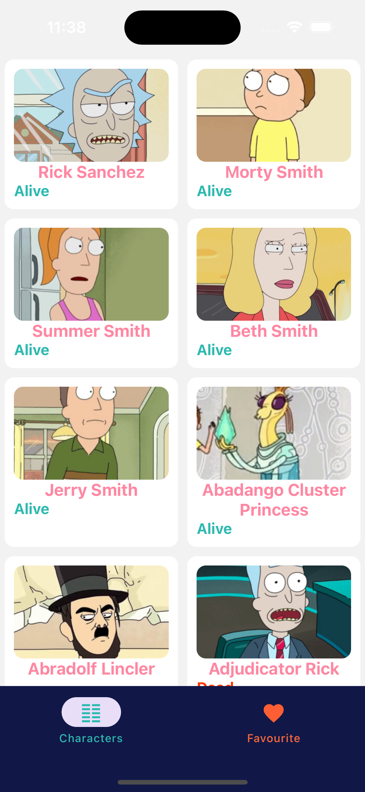
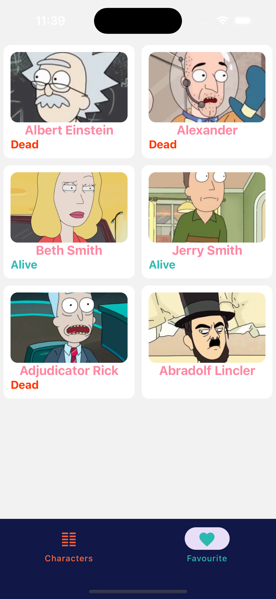
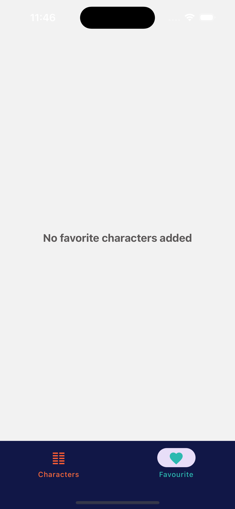
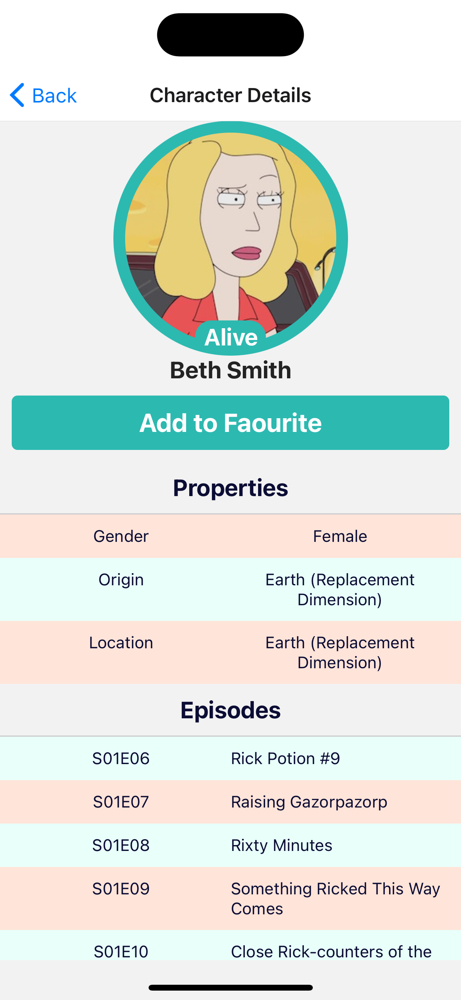
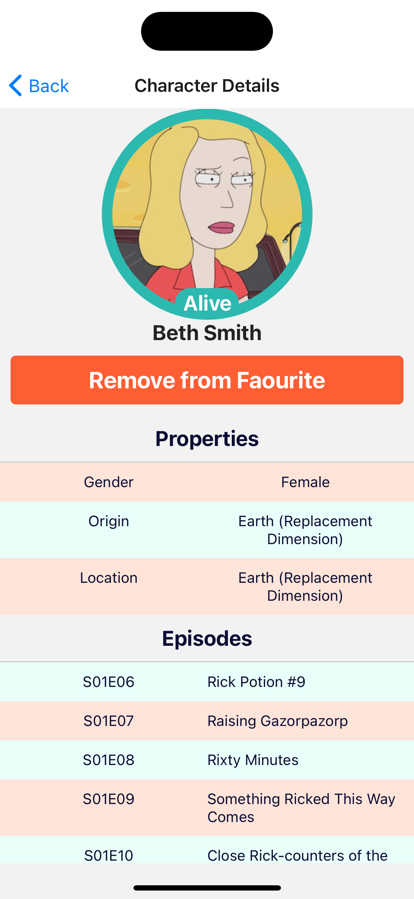
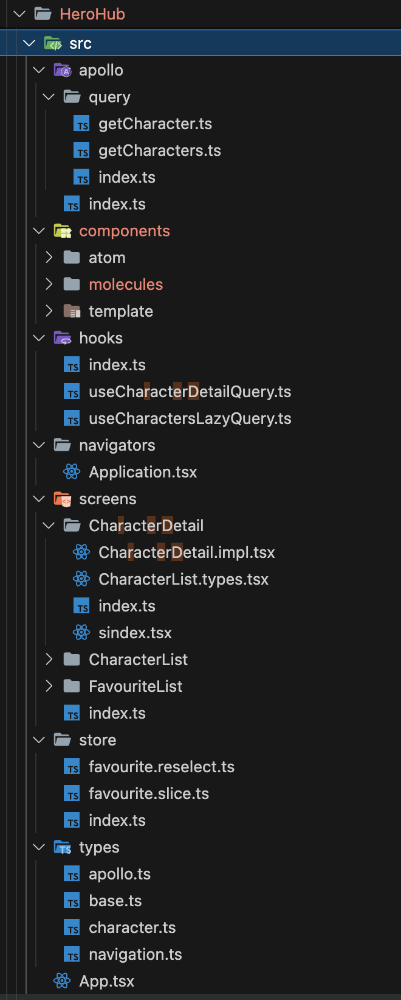
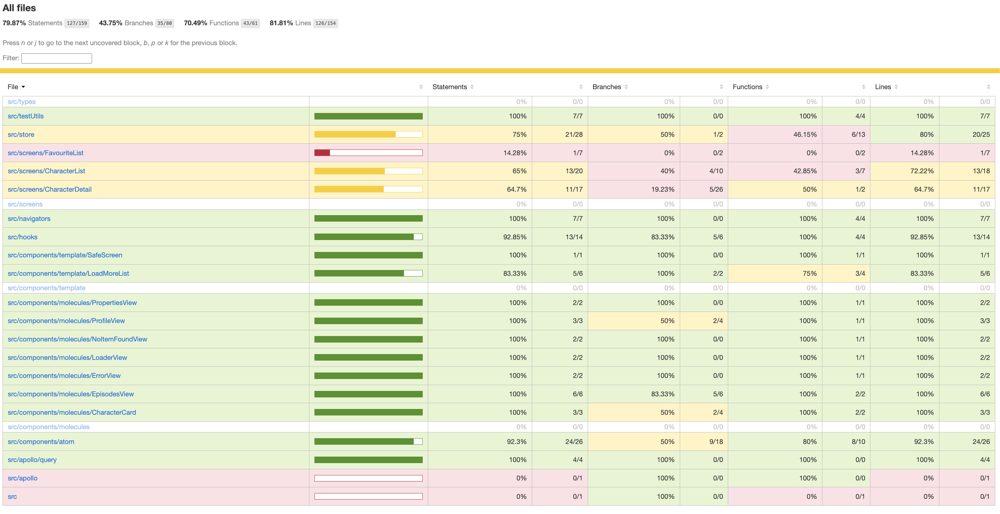

# HeroHub

## Project Description

This project is a React Native application that utilizes the GraphQL API for the Rick and Morty API. The application allows users to explore characters from the Rick and Morty universe, view their details, and add or remove them from a favorite list.

## Screens

The project consists of the following screens:

### Home Screen

The Home screen contains two tabs:

1. Character List: Displays a list of characters from the Rick and Morty universe.
2. Favorite Character List: Displays a list of characters that the user has added to their favorites.

  

### Character Detail Screen

The Character Detail screen displays detailed information about a specific character. Users can view the character's properties and episodes they appear in. Additionally, users can add or remove the character from their favorite list.

 

## Folder Structure

### Libraries and Coding Practices Used

The Home screen contains two tabs:

1. TypeScript: The project is written in TypeScript to provide static typing and improve code maintainability.
2. Redux Toolkit: Redux Toolkit is used for state management, providing a simplified and opinionated approach to using Redux.
3. Atomic Design Pattern: The project follows the Atomic Design pattern for organizing components, allowing for better scalability and reusability.
4. Styled Components: Styled Components is used for styling, allowing for the creation of styled React components with the power of CSS-in-JS.

### Code Coverage

## Author

- [Kishore](https://www.linkedin.com/in/kishore-raj-0169242a/)
